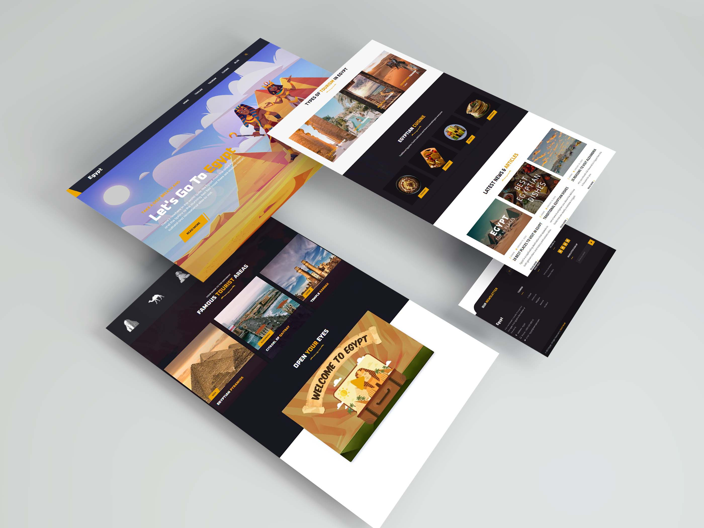

<div align="center">
<h1 align="center">🏜️ Egyptour – Explore Egypt with a Responsive Tourism Website</h1>
Egyptour is a fully responsive tourism website designed for visitors exploring Egypt's breathtaking landmarks. Built with HTML, CSS, and JavaScript, this template works seamlessly on all devices, making it perfect for travel agencies, tour guides, and adventurers.
<br />
<br />
<a href="https://ahmed-abd-alalim.github.io/Egyptour/"><strong>➥ Live Demo</strong></a>
<br />
<br />
</div>


## Demo




## programming language and tools

<p>
   <a href="#">
    
   </a>
</p>


##  Features

<p>✅Fully Responsive – Optimized for desktops, tablets, and mobile devices</p>
<p>✅ Discover Egypt’s Top Destinations – Showcases famous sites like the Pyramids, Luxor, and the Red Sea</p>
<p>✅ Modern UI/UX – Clean and visually stunning design</p>
<p>✅ Interactive Maps – Helps travelers locate must-see spots</p>
<p>✅ Smooth Animations – Engaging transitions for a dynamic experience</p>
<p>✅ Optimized Performance – Fast loading and SEO-friendly</p>


## Prerequisites

Before you begin, ensure you have met the following requirements:

* [Git](https://git-scm.com/downloads "Download Git") must be installed on your operating system.


## Installing Egyptour

To install **Egyptour**, follow these steps:

Linux and macOS:

```bash
sudo git clone https://github.com/ahmed-abd-alalim/Egyptour.git
```

Windows:

```bash
git clone https://github.com/ahmed-abd-alalim/Egyptour.git
```


## Contact

<p align="left">
  <a href="https://www.linkedin.com/in/ahmed-abd-alalim-286768299/" target="_blank"></a>
</p>


## License

This program has been licensed under the MIT License. If you are a true FOSS (Free And Open Source Software) Lover, you wont customize this and redistribute this under your name
